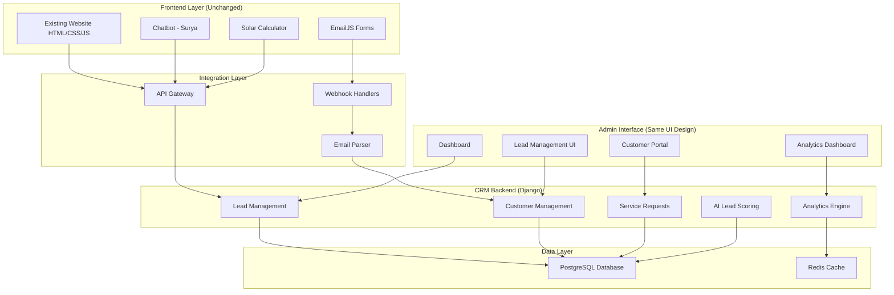

# Solar CRM Platform - Design Document

## Overview

The Solar CRM Platform is a Django-based customer relationship management system that operates as an invisible backend intelligence layer for Sunrise Power's existing website. The system captures and processes all customer interactions from the current frontend (chatbot, EmailJS forms, website activities) without requiring any changes to the existing HTML, CSS, or JavaScript. The admin interface maintains complete visual consistency with the existing website design, using identical styling, colors, fonts, and design patterns to provide a seamless brand experience.

The architecture follows a dual-interface approach: the existing frontend remains completely unchanged for website visitors, while a separate admin dashboard provides comprehensive CRM functionality using the same visual design language. All data capture happens invisibly through API endpoints that integrate with existing frontend components.

## Architecture

### High-Level Architecture



### System Components

**Frontend Integration Layer:**
- API endpoints that receive data from existing frontend components
- Webhook handlers for EmailJS integration
- Background data capture without affecting user experience

**Core CRM Engine:**
- Django-based backend with modular app structure
- RESTful API design for scalability
- Asynchronous task processing for email parsing and lead scoring

**Admin Interface:**
- Django templates using identical CSS from existing website
- Responsive design matching current website patterns
- Role-based access control for different user types

## Components and Interfaces

### Core Django Apps

**1. Leads App (`leads/`)**
- Models: Lead, LeadSource, LeadInteraction, LeadScore
- Views: Lead list, detail, conversion, scoring dashboard
- APIs: Lead creation, update, scoring endpoints

**2. Customers App (`customers/`)**
- Models: Customer, CustomerHistory, ContactInfo
- Views: Customer management, history tracking, profile management
- APIs: Customer CRUD operations, history retrieval

**3. Services App (`services/`)**
- Models: ServiceRequest, AMCContract, InstallationProject
- Views: Service ticket management, AMC tracking, project monitoring
- APIs: Service request creation, status updates, contract management

**4. Analytics App (`analytics/`)**
- Models: AnalyticsData, ConversionMetrics, RevenueTracking
- Views: Dashboard, reports, performance metrics
- APIs: Real-time analytics data, report generation

**5. Integrations App (`integrations/`)**
- Models: EmailLog, ChatbotInteraction, CalculatorData
- Views: Integration monitoring, data validation
- APIs: Webhook endpoints, data ingestion

### API Endpoints

**Lead Management APIs:**
```
POST /api/leads/create/          # Create new lead from frontend
GET  /api/leads/                 # List leads with filtering
PUT  /api/leads/{id}/convert/    # Convert lead to customer
POST /api/leads/score/           # Trigger AI lead scoring
```

**Customer Management APIs:**
```
GET  /api/customers/             # List customers
POST /api/customers/             # Create customer record
PUT  /api/customers/{id}/        # Update customer info
GET  /api/customers/{id}/history/ # Get interaction history
```

**Service Request APIs:**
```
POST /api/services/requests/     # Create service request
GET  /api/services/requests/     # List service requests
PUT  /api/services/requests/{id}/status/ # Update request status
```

**Integration APIs:**
```
POST /api/integrations/chatbot/  # Receive chatbot data
POST /api/integrations/email/    # EmailJS webhook
POST /api/integrations/calculator/ # Solar calculator data
```

### Frontend Integration Points

**Chatbot Integration:**
- Modify existing `chat.js` to send user data to CRM API
- Add invisible API calls after successful chatbot interactions
- Preserve existing chatbot functionality completely

**EmailJS Integration:**
- Configure EmailJS webhooks to send copies to CRM
- Parse email content for lead information extraction
- Maintain existing email delivery functionality

**Form Integration:**
- Add hidden API calls to existing form submissions
- Capture form data before EmailJS processing
- Ensure no disruption to current form behavior

## Data Models

### Lead Model
```python
class Lead(models.Model):
    # Basic Information
    first_name = models.CharField(max_length=100)
    last_name = models.CharField(max_length=100)
    email = models.EmailField(unique=True)
    phone = models.CharField(max_length=20)
    
    # Lead Details
    source = models.ForeignKey(LeadSource, on_delete=models.CASCADE)
    status = models.CharField(max_length=20, choices=LEAD_STATUS_CHOICES)
    score = models.IntegerField(default=0)
    interest_level = models.CharField(max_length=20)
    
    # Solar Specific
    property_type = models.CharField(max_length=50)
    estimated_capacity = models.DecimalField(max_digits=10, decimal_places=2, null=True)
    budget_range = models.CharField(max_length=50, null=True)
    
    # Tracking
    created_at = models.DateTimeField(auto_now_add=True)
    updated_at = models.DateTimeField(auto_now=True)
    converted_at = models.DateTimeField(null=True, blank=True)
    
    # Metadata
    original_data = models.JSONField(default=dict)  # Store original interaction data
```

### Customer Model
```python
class Customer(models.Model):
    # Converted from Lead
    lead = models.OneToOneField(Lead, on_delete=models.CASCADE, null=True)
    
    # Enhanced Information
    company_name = models.CharField(max_length=200, blank=True)
    address = models.TextField()
    city = models.CharField(max_length=100)
    state = models.CharField(max_length=100)
    pincode = models.CharField(max_length=10)
    
    # Customer Status
    status = models.CharField(max_length=20, choices=CUSTOMER_STATUS_CHOICES)
    customer_type = models.CharField(max_length=20)  # Residential, Commercial, Industrial
    
    # Financial
    total_value = models.DecimalField(max_digits=12, decimal_places=2, default=0)
    outstanding_amount = models.DecimalField(max_digits=12, decimal_places=2, default=0)
    
    # Timestamps
    created_at = models.DateTimeField(auto_now_add=True)
    updated_at = models.DateTimeField(auto_now=True)
```

### ServiceRequest Model
```python
class ServiceRequest(models.Model):
    # Request Details
    ticket_number = models.CharField(max_length=20, unique=True)
    customer = models.ForeignKey(Customer, on_delete=models.CASCADE)
    request_type = models.CharField(max_length=50, choices=REQUEST_TYPE_CHOICES)
    priority = models.CharField(max_length=20, choices=PRIORITY_CHOICES)
    
    # Content
    subject = models.CharField(max_length=200)
    description = models.TextField()
    status = models.CharField(max_length=20, choices=STATUS_CHOICES)
    
    # Assignment
    assigned_to = models.ForeignKey(User, on_delete=models.SET_NULL, null=True)
    
    # Tracking
    created_at = models.DateTimeField(auto_now_add=True)
    updated_at = models.DateTimeField(auto_now=True)
    resolved_at = models.DateTimeField(null=True, blank=True)
    
    # Source tracking
    source_email = models.TextField(blank=True)  # Original email content
```

### AMCContract Model
```python
class AMCContract(models.Model):
    # Contract Details
    contract_number = models.CharField(max_length=20, unique=True)
    customer = models.ForeignKey(Customer, on_delete=models.CASCADE)
    installation_project = models.ForeignKey('InstallationProject', on_delete=models.CASCADE)
    
    # Contract Terms
    start_date = models.DateField()
    end_date = models.DateField()
    annual_value = models.DecimalField(max_digits=10, decimal_places=2)
    
    # Status
    status = models.CharField(max_length=20, choices=CONTRACT_STATUS_CHOICES)
    renewal_reminder_sent = models.BooleanField(default=False)
    
    # Timestamps
    created_at = models.DateTimeField(auto_now_add=True)
    updated_at = models.DateTimeField(auto_now=True)
```

### InstallationProject Model
```python
class InstallationProject(models.Model):
    # Project Details
    project_number = models.CharField(max_length=20, unique=True)
    customer = models.ForeignKey(Customer, on_delete=models.CASCADE)
    
    # Technical Details
    system_capacity = models.DecimalField(max_digits=10, decimal_places=2)
    panel_brand = models.CharField(max_length=100)
    inverter_brand = models.CharField(max_length=100)
    installation_type = models.CharField(max_length=50)
    
    # Project Status
    status = models.CharField(max_length=30, choices=PROJECT_STATUS_CHOICES)
    progress_percentage = models.IntegerField(default=0)
    
    # Financial
    project_value = models.DecimalField(max_digits=12, decimal_places=2)
    amount_paid = models.DecimalField(max_digits=12, decimal_places=2, default=0)
    
    # Dates
    quotation_date = models.DateField(null=True)
    approval_date = models.DateField(null=True)
    installation_start_date = models.DateField(null=True)
    completion_date = models.DateField(null=True)
    
    # Timestamps
    created_at = models.DateTimeField(auto_now_add=True)
    updated_at = models.DateTimeField(auto_now=True)
```
## Correctness Properties

*A property is a characteristic or behavior that should hold true across all valid executions of a system-essentially, a formal statement about what the system should do. Properties serve as the bridge between human-readable specifications and machine-verifiable correctness guarantees.*

### Property Reflection

After analyzing all acceptance criteria, several properties can be consolidated to eliminate redundancy:

- **UI Consistency Properties** (1.1, 1.2, 10.1, 10.2, 10.3, 14.1, 14.2, 14.3, 14.4) can be combined into comprehensive UI consistency properties
- **Data Preservation Properties** (1.4, 2.4, 4.3, 4.4, 6.4) can be consolidated into general data preservation properties
- **Email Processing Properties** (2.1, 2.2, 2.3, 7.2) can be combined into comprehensive email-to-record conversion properties
- **Performance Properties** (3.5, 4.5) can be consolidated into general API performance requirements
- **Frontend Preservation Properties** (1.5, 10.5, 13.1, 13.2, 13.3, 13.4, 13.5) can be combined into comprehensive frontend preservation properties

### Core Correctness Properties

**Property 1: UI Consistency Across Interfaces**
*For any* admin dashboard page or component, the styling should maintain visual consistency with the frontend website's design language including color palette (#fcf8f0 background, #3D2B1F text, #fdd835 accents), typography (Poppins), spacing, and component patterns to provide a seamless brand experience
**Validates: Requirements 1.1, 1.2, 10.1, 10.2, 10.3, 14.1, 14.2, 14.3, 14.4**

**Property 2: Data Preservation During Operations**
*For any* data transformation operation (lead conversion, record merging, status updates), all original data, interaction history, and timestamps should be preserved without loss
**Validates: Requirements 1.4, 2.4, 4.3, 4.4, 6.4, 8.5, 9.5**

**Property 3: Email-to-Record Conversion with Confidence Scoring**
*For any* email received through EmailJS, the system should parse content to extract lead or service request data with confidence scoring, create appropriate CRM records when confidence is high, and flag for manual review when confidence is below threshold while preserving full raw email content
**Validates: Requirements 2.1, 2.2, 2.3, 7.2**

**Property 4: Frontend Functionality Preservation with Minimal Integration**
*For any* existing website functionality, the behavior and user experience should remain unchanged after CRM integration, with only minimal non-visual API calls added to existing JavaScript for data submission without altering UI behavior, layout, or user flows
**Validates: Requirements 1.5, 10.5, 13.1, 13.2, 13.3, 13.4, 13.5**

**Property 5: Intelligent Duplicate Detection and Handling**
*For any* lead or customer creation event, the system should perform duplicate detection using email and phone matching, automatically merge records when confidence is high, flag for manual review when confidence is uncertain, and preserve all historical data and interactions without hard-blocking record creation
**Validates: Requirements 4.1, 4.2, 4.5**

**Property 6: API Integration Completeness**
*For any* frontend interaction (chatbot, calculator, forms), the system should capture and submit data to the CRM via API endpoints while maintaining response times under 5 seconds
**Validates: Requirements 3.1, 3.5, 5.1**

**Property 7: Service Request Lifecycle Management**
*For any* service request creation (form submission or email), the system should create a ServiceRequest with unique ticket number, initial status, and proper customer association when identifiable
**Validates: Requirements 7.1, 7.3, 7.5**

**Property 8: Rule-Based Lead Prioritization**
*For any* lead record, the prioritization system should analyze available data sources (calculator, chatbot, engagement) using rule-based logic and assign priority levels with reasoning
**Validates: Requirements 11.1, 11.2, 11.3, 11.4**

**Property 9: Contract and Project Tracking**
*For any* AMC contract or installation project, the system should track all stages, dates, milestones, and generate appropriate alerts and notifications
**Validates: Requirements 8.1, 8.2, 8.3, 8.4**

**Property 10: Financial Data Accuracy**
*For any* payment or invoice operation, the system should maintain accurate real-time balances, payment status, and complete audit trails
**Validates: Requirements 9.1, 9.2, 9.3, 9.4**

**Property 11: RESTful API Consistency**
*For any* API endpoint, the system should follow consistent RESTful conventions and support standardized integration patterns
**Validates: Requirements 12.1, 12.4**

**Property 12: Error Handling and Graceful Degradation**
*For any* system failure (email parsing, calculator integration, API errors), the system should log errors, notify administrators, and continue operation without disrupting user experience
**Validates: Requirements 2.5, 5.5**

## Error Handling

### Error Categories and Responses

**1. Email Processing Errors**
- **Scenario**: EmailJS webhook fails or email parsing encounters malformed content
- **Response**: Log error with full email content, create manual review task, notify administrators
- **Fallback**: Store raw email data for manual processing

**2. API Integration Errors**
- **Scenario**: Frontend API calls fail due to network issues or server errors
- **Response**: Implement retry logic with exponential backoff, cache failed requests
- **Fallback**: Continue frontend operation without disruption, queue data for later processing

**3. Duplicate Detection Failures**
- **Scenario**: Duplicate detection service is unavailable or times out
- **Response**: Allow record creation with duplicate flag, schedule background duplicate check
- **Fallback**: Manual duplicate resolution through admin interface

**4. AI Scoring Service Errors**
- **Scenario**: Lead scoring service fails or returns invalid results
- **Response**: Assign default score, log error, schedule re-scoring
- **Fallback**: Manual lead prioritization through admin interface

**5. Database Connection Issues**
- **Scenario**: Database becomes unavailable or connection pool exhausted
- **Response**: Implement connection retry logic, use read replicas for queries
- **Fallback**: Cache critical data in Redis, display cached dashboard data

### Error Monitoring and Alerting

**Real-time Monitoring**
- API response times and error rates
- Email processing success/failure rates
- Database query performance
- Frontend integration health checks

**Alert Thresholds**
- API error rate > 5% in 5-minute window
- Email processing failures > 10 in 1 hour
- Database response time > 2 seconds
- Frontend integration failures > 3 consecutive attempts

**Notification Channels**
- Email alerts to administrators
- Dashboard error indicators
- System health status page
- Integration with monitoring tools (optional)

## Testing Strategy

### Dual Testing Approach

The system requires both unit testing and property-based testing to ensure comprehensive coverage:

**Unit Tests** verify specific examples, edge cases, and error conditions
**Property Tests** verify universal properties that should hold across all inputs

Together they provide comprehensive coverage: unit tests catch concrete bugs, property tests verify general correctness.

### Unit Testing Requirements

**Coverage Areas:**
- Model validation and constraints
- API endpoint functionality
- Email parsing logic
- UI component rendering
- Integration point behavior

**Key Test Cases:**
- Lead creation with various data combinations
- Customer conversion workflows
- Service request lifecycle management
- Email parsing with different formats
- Duplicate detection with edge cases

**Testing Tools:**
- Django's built-in testing framework
- Factory Boy for test data generation
- Mock for external service simulation
- Selenium for UI consistency testing

### Property-Based Testing Requirements

**Property Testing Library:** Hypothesis (Python)
**Minimum Iterations:** 100 iterations per property test
**Property Test Tagging:** Each property-based test must include a comment with the format: `**Feature: solar-crm-platform, Property {number}: {property_text}**`

**Property Test Implementation:**
- Each correctness property must be implemented by a single property-based test
- Tests should generate random valid inputs across the expected data ranges
- Properties should verify invariants that must hold regardless of input values
- Failed property tests should provide clear counterexamples for debugging

**Property Test Categories:**
1. **Data Integrity Properties** - Verify data preservation across operations
2. **UI Consistency Properties** - Verify styling and design consistency
3. **Integration Properties** - Verify API and external service integration
4. **Performance Properties** - Verify response time requirements
5. **Business Logic Properties** - Verify domain-specific rules and workflows

### Integration Testing

**Frontend Integration Tests:**
- Verify existing website functionality remains unchanged
- Test API integration points without affecting user experience
- Validate data capture from frontend interactions

**Email Integration Tests:**
- Test EmailJS webhook processing
- Verify email parsing accuracy
- Validate service request creation from emails

**External Service Integration:**
- Test chatbot API integration
- Verify calculator data submission
- Validate third-party service compatibility

### Performance Testing

**Load Testing Requirements:**
- API endpoints should handle 100 concurrent requests
- Database queries should complete within 2 seconds
- Dashboard should load within 5 seconds with 1000+ records

**Stress Testing Scenarios:**
- High-volume email processing (100+ emails/hour)
- Concurrent lead creation and duplicate detection
- Large dataset analytics generation

### UI Consistency Testing

**Automated Visual Testing:**
- Compare computed CSS styles between frontend and admin
- Verify color values match exactly (#fcf8f0, #3D2B1F, #fdd835)
- Validate font family consistency (Poppins)
- Check responsive design behavior

**Manual Testing Checklist:**
- Visual comparison of admin and frontend interfaces
- User experience flow testing
- Cross-browser compatibility verification
- Mobile responsiveness validation

This comprehensive testing strategy ensures that the Solar CRM Platform maintains the highest quality standards while preserving the existing website functionality and providing reliable business intelligence capabilities.

## Implementation Clarifications

### Asynchronous Processing Architecture

**Background Task Processing Options:**
- Email parsing and content extraction
- Lead prioritization calculations
- Duplicate detection and confidence scoring
- Analytics computation and dashboard metrics
- AMC renewal notifications and alerts

**Implementation Flexibility:**
- Can use Django's built-in database-backed task queue for simple deployments
- Can integrate with external task queues (Celery, RQ, etc.) for scalability
- Can implement synchronous processing for Phase 1 with async migration path
- Task monitoring and failure handling should be implementation-agnostic

**Performance Targets (not guarantees):**
- API response times should target under 3 seconds under normal load
- Frontend interactions should not be blocked by CRM processing
- Background tasks should target completion within reasonable timeframes (5-30 minutes depending on complexity)

### Email Processing with Confidence Scoring

**Confidence Scoring Algorithm:**
```python
def calculate_email_confidence(email_content):
    confidence_factors = {
        'contact_info_present': 0.3,  # Email, phone found
        'service_keywords': 0.2,     # Installation, maintenance, etc.
        'structured_format': 0.2,    # Form-like structure
        'complete_fields': 0.3       # All expected fields present
    }
    # Return confidence score 0.0 to 1.0
```

**Email Processing Rules:**
- Confidence > 0.8: Auto-create records
- Confidence 0.5-0.8: Create with manual review flag
- Confidence < 0.5: Store raw email, require manual processing
- Missing or malformed fields: Always fall back to manual review with preserved raw content

### Security and Access Control

**Role-Based Access Control (RBAC):**
```python
ROLES = {
    'owner': ['view_all', 'edit_all', 'delete_all', 'manage_users'],
    'sales_manager': ['view_leads', 'edit_leads', 'view_customers', 'view_analytics'],
    'sales_staff': ['view_assigned_leads', 'edit_assigned_leads', 'create_leads'],
    'support_staff': ['view_service_requests', 'edit_service_requests', 'view_customers']
}
```

**API Security:**
- JWT token authentication for API endpoints
- Rate limiting on public-facing endpoints
- CSRF protection for admin interface
- Input validation and sanitization
- SQL injection prevention through ORM

**Data Protection:**
- Encrypt sensitive customer data at rest
- Secure transmission using HTTPS/TLS
- Regular security audits and vulnerability scanning
- GDPR compliance for data handling and deletion

### Audit Logging System

**Audit Trail Requirements:**
```python
class AuditLog(models.Model):
    user = models.ForeignKey(User, on_delete=models.CASCADE)
    action = models.CharField(max_length=50)  # CREATE, UPDATE, DELETE, VIEW
    model_name = models.CharField(max_length=50)
    object_id = models.CharField(max_length=50)
    changes = models.JSONField(default=dict)  # Before/after values
    timestamp = models.DateTimeField(auto_now_add=True)
    ip_address = models.GenericIPAddressField()
    user_agent = models.TextField()
```

**Logged Actions:**
- Lead status changes and conversions
- Customer record updates
- Service ticket status transitions
- Financial record modifications
- User login/logout events
- Admin configuration changes

### Phase 1 Scope Boundaries

**Included in Phase 1:**
- Core CRM functionality (leads, customers, services)
- EmailJS integration and parsing
- Basic chatbot data capture
- Admin dashboard with website styling
- Rule-based lead scoring
- Service request management
- Basic analytics and reporting

**Explicitly Excluded from Phase 1:**
- Frontend redesign or replacement
- Advanced AI/ML lead scoring
- Real-time chat handling in Django
- Payment gateway integrations
- External CRM platform synchronization
- Advanced workflow automation
- Mobile app development
- Third-party integrations beyond EmailJS

### Extensibility Architecture

**Future Enhancement Readiness:**
- Plugin architecture for scoring algorithms
- Webhook system for external integrations
- API versioning for backward compatibility
- Modular frontend components for easy updates
- Database schema designed for additional fields
- Caching layer for performance optimization

This implementation approach ensures a solid foundation while maintaining flexibility for future enhancements and scaling requirements.